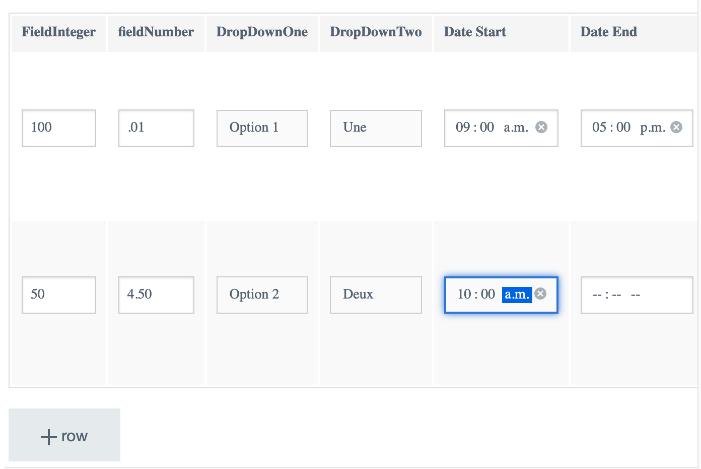

# JSON Schema Form Editor


### Background

This extension is based on the Contentful example below:

https://www.contentful.com/blog/2016/07/06/ui-extensions-sdk/

This extension uses 'json-editor'library (v7.28) which is a JSON Schema based editor. 

https://github.com/jdorn/json-editor

### Dependencies
- json-editor: https://github.com/json-editor/json-editor
    >  npm install --save @json-editor/json-editor@2.4.0
- lodash
    > npm install --save lodash@4.17.20  


### Features

Based on a json schema you define in the /schema folder, it would translate the json structure into a form representation which then binds to a json object structure. It is intended to be applied onto a Contentful field of type 'object'

i.e: 
<b>FROM</b>

<u>JSON Schema Definition</u>

```json
{
    "$schema": "http://json-schema.org/draft-07/schema",
    "$id": "http://example.com/example.json",
    "type": "array",
    "format": "table",
    "title": " ",
    "default": [],
    "additionalItems": true,
    "description": "Your Field Description",
    
    "items": {
        "$id": "#/items/0",
        "type": "object",
        "title": "",
        "default": {},
        "properties": {
            "JsonObjectOne": {
                "$id": "#/items/0/properties/fieldInteger",
                "type": "integer",
                "title": "FieldInteger",
                "required": false,
                "default": ""
            },
            "JsonObjectTwo": {
                "$id": "#/items/0/properties/fieldNumber",
                "type": "number",
                "title": "fieldNumber",
                "optional" : true,
                "required": false,
                "default": ""
            },
            "JsonObjectThree": {
                "$id": "#/items/0/properties/dropDownOne",
                "type": "string",
                "title": "DropDownOne",
                "enum": [
                    "option_one",
                    "option_two",
                    "option_three"
                ],
                "options": {
                    "enum_titles": ["Option 1","Option 2","Option 3"]
                }
            },
            "JsonObjectFour": {
                "$id": "#/items/0/properties/dropDownTwo",
                "type": "string",
                "title": "DropDownTwo",
                "enum": [
                    "choice_one",
                    "choice_two",
                    "choice_three",
                    "choice_other"
                ],
                "options": {
                    "enum_titles": ["Une","Deux","Trois", "Autre"]
                }
            },
            "dateStart": {
                "$id": "#/items/0/properties/dateStart",
                "type": "string",
                "format": "time",
                "title": "Date Start"
            },
            "dateEnd": {
                "$id": "#/items/0/properties/dateEnd",
                "type": "string",
                "format": "time",
                "title": "Date End"
            }
            
        },
            "additionalProperties": false
        
        }
      
    }
```

<b>TO</b>

<u>Editor UI</u>


<u>Stored JSON Structure</u>
```json
[
    {
        "JsonObjectOne": 100,
        "JsonObjectTwo": 0.01,
        "JsonObjectThree": "option_one",
        "JsonObjectFour": "choice_one",
        "dateStart": "09:00",
        "dateEnd": "17:00"
    },
    {
        "JsonObjectOne": 50,
        "JsonObjectTwo": 4.5,
        "JsonObjectThree": "option_two",
        "JsonObjectFour": "choice_two",
        "dateStart": "10:00",
        "dateEnd": ""
    }
]
```